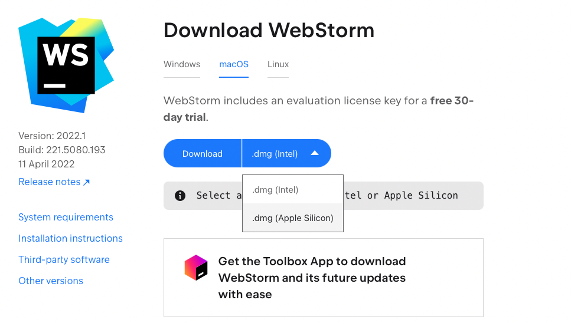
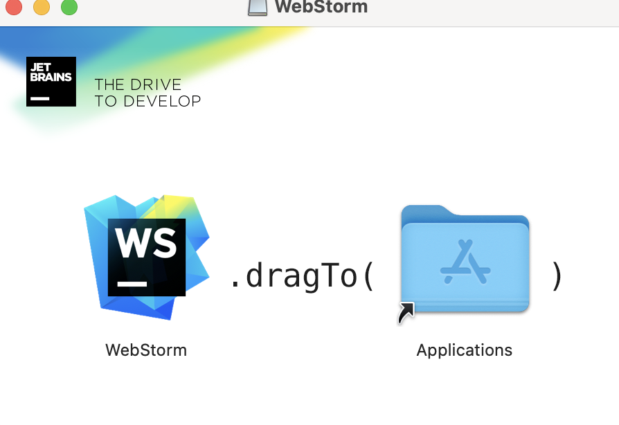
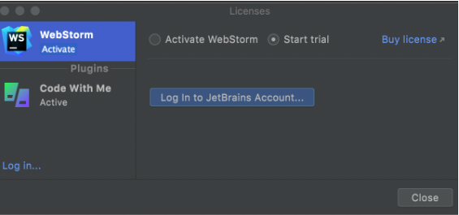
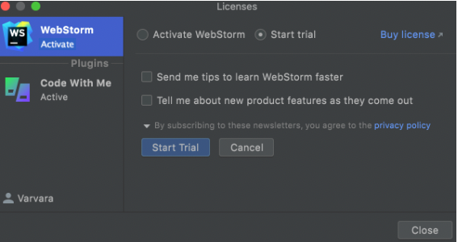
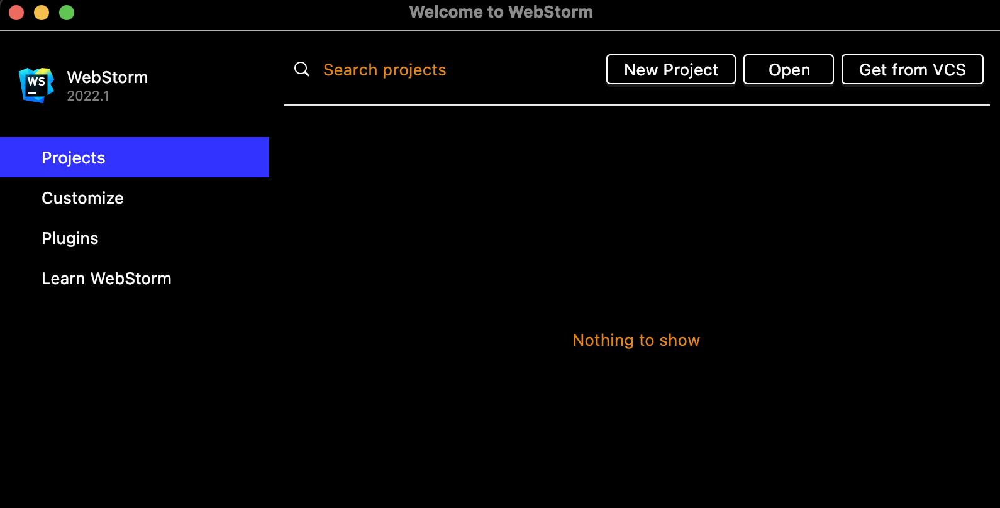

# Handleiding - webapplicatie WEBSHOP

In deze webapplicatie WEBSHOP is mogelijk om  producten te bestellen. De gebruikers kunnen zich registreren en daarna met hun gegevens inloggen. Ingelogde gebruikers kunnen hun eigen profiel bekijken met hun eigen gegevens en bestelgeschiedenis. Er zijn twee rollen aanwezig - customers en admin(productbeheerder). Alleen admin kan producten toevoegen met productformulier die verschijnt nadat de admin is ingelogd. 

## Benodigheden

Om deze applicatie te kunnen implementeren zijn er verschillende benodigheden nodig. Deze dienen van tevoren geïnstalleerd worden. 

#### LET OP!
Er wordt gebruik gemaakt van eigen backend. Deze heeft eigen benodigheden zoals IDE IntelliJ en PostgreSQL. Handleiding om deze te instaleren is aangeleverd(zie bestand Eindopdracht Backend).

### Os
Alle benodigheden zijn te downloaden voor elke besturing systeem. Deze applicatie is gemaakt op MacOs en daarom zijn de gebruikte links naar downloads voor MacOs bedoeld.

### IDE
Om de code te kunnen beordelen is er een IDE nodig. Deze code is geschreven in WebStorm.
WebStorm is te downloaden via https://www.jetbrains.com/webstorm/download/#section=mac.

1. Kies een installer voor Intel of Apple Silicon en klik op download

2. Verplaats de icon tussen applicaties folder

3. Voor volle features is een licencie nodig maar het is mogelijk om dit ook voor 30 dagen gratis te gebruiken.

4. Maak JetBrains account aan op de website van JetBrains.

5. Na openen van WebStorm kies WebStorm Ativate en kies Start Trial en druk op Log in to JetBrains Account.

6. Log in met JetBrains account op website en click Start Trial button in License dialog om met trial te beginnen.

7. De IDE is klaar voor gebruik

### NODE.JS
Om een ideale omgeving voor development tools zoals Webpack en Eslint te creëren, moet ook Node.js geinstallerd worden. Node.js zorgt ook voor open-source libraries welke worden gebruikt doormiddel van package manager NPM.
1. Gebruik deze link: https://nodejs.org/en/download/ om node.js globaal op het computer te installeren.

2. Volg de instructies in de installer.

3. Om te controlleren of node.js geinstallerd is, run in terminaal commando (nadat er een nieuwe of bestande project geopend is (volg stappen Applicatie starten)):

### node -v

4. Als node.js goed geinstallerd is, komt een versienummer in de terminaal te verschijnen

5. Om te controlleren of NPM correct mee geinstallerd is, run in terminaal commando:

### npm -v

6. Als NPM goed geinstallerd is, komt weer een andere versienummer in terminaal te zien.

7. De node.js en npm zijn goed geinstalleerd.

## Applicatie starten

1.Open WebStrom en druk op Open, kies de bestand en dubbleklik erop.

2. Eerst moeten de "node_modules" geinstallerd worden. Druk op terminaal en run een commando:
### `npm install`

3. Als dat klaar is, kan de applicatie gestart worden met de commando:
### `npm start`

4. Er opent automatisch een pagina in de browser of open http://localhost.3000 in de browers.
5. De applicatie runt.

## Inloggegevens

Er is al een account van admin. Alleen admin is geautoriseerd om een product toe voegen.

### username: admin

### wachtwoord: password

## Git

Tijdens het bouwen van deze applicatie werd een Git gebruikt. 

### https://github.com/zuzanasorokova/frontend-eindopdracht-webshop

